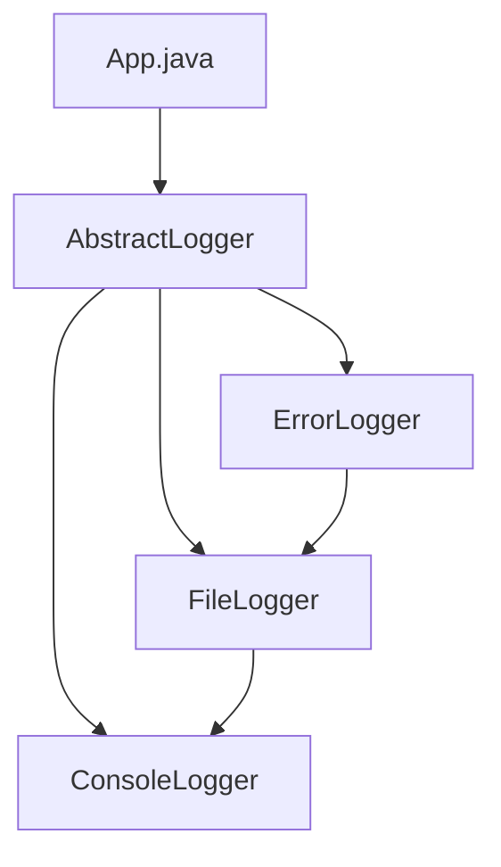

# Chain of Responsibility Pattern

## What is the Chain of Responsibility Pattern?
The Chain of Responsibility Pattern is a behavioral design pattern that lets you pass requests along a chain of handlers. Upon receiving a request, each handler decides either to process the request or to pass it to the next handler in the chain.

## Implementation in This Project
This example demonstrates the Chain of Responsibility pattern by creating a chain of loggers:

- `AbstractLogger`: Abstract handler that defines the chain structure.
- `ConsoleLogger`, `ErrorLogger`, `FileLogger`: Concrete handlers.
- The chain is built with ErrorLogger -> FileLogger -> ConsoleLogger.

## Class Diagram


## Example Usage
```java
AbstractLogger loggerChain = getChainOfLoggers();

loggerChain.logMessage(AbstractLogger.INFO, "This is an information.");
loggerChain.logMessage(AbstractLogger.DEBUG, "This is a debug level information.");
loggerChain.logMessage(AbstractLogger.ERROR, "This is an error information.");
```

## When to Use
- When you want to give more than one object a chance to handle a request.
- When the set of objects that can handle a request should be specified dynamically. 