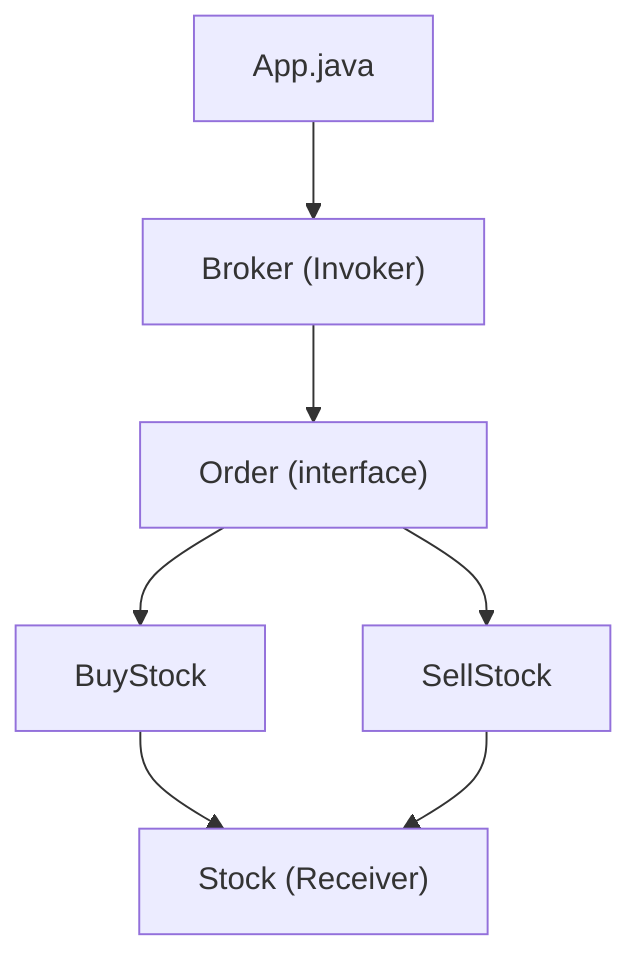

# Command Pattern

## What is the Command Pattern?
The Command Pattern is a behavioral design pattern that turns a request into a stand-alone object containing all information about the request. This transformation lets you parameterize methods with different requests, delay or queue a request's execution, and support undoable operations.

## Implementation in This Project
This example demonstrates the Command pattern by implementing stock trading orders:

- `Order`: Command interface.
- `BuyStock`, `SellStock`: Concrete commands.
- `Stock`: Receiver that performs the actual operations.
- `Broker`: Invoker that takes and executes commands.

## Class Diagram


## Example Usage
```java
Stock abcStock = new Stock();

BuyStock buyStockOrder = new BuyStock(abcStock);
SellStock sellStockOrder = new SellStock(abcStock);

Broker broker = new Broker();
broker.takeOrder(buyStockOrder);
broker.takeOrder(sellStockOrder);

broker.placeOrders();
```

## When to Use
- When you want to parameterize objects with operations.
- When you want to queue operations, schedule their execution, or execute them remotely. 