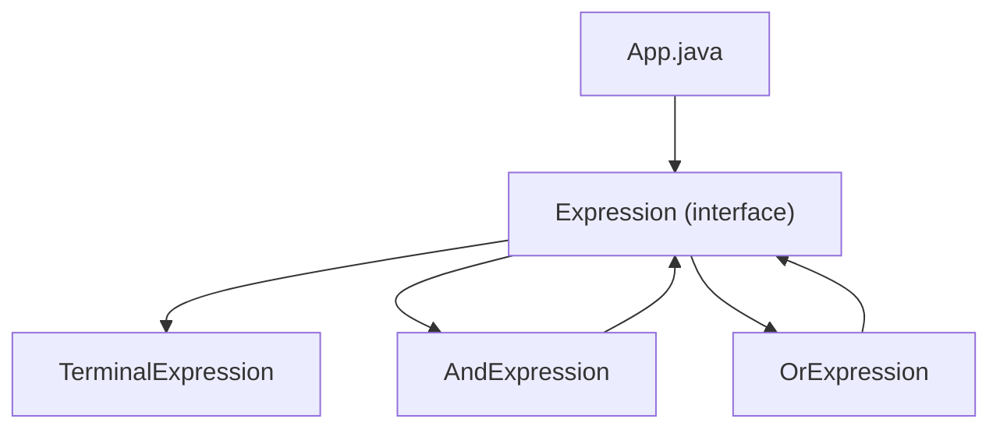

# Interpreter Pattern

## What is the Interpreter Pattern?
The Interpreter Pattern is a behavioral design pattern that defines a grammatical representation for a language and provides an interpreter to deal with this grammar. This pattern is used to evaluate sentences in a language.

## Implementation in This Project
This example demonstrates the Interpreter pattern by creating expressions to interpret sentences:

- `Expression`: Abstract expression interface.
- `TerminalExpression`: Terminal expression for simple terms.
- `AndExpression`, `OrExpression`: Non-terminal expressions for complex operations.

## Class Diagram


## Example Usage
```java
Expression isMale = getMaleExpression();
Expression isMarriedWoman = getMarriedWomanExpression();

System.out.println("John is male? " + isMale.interpret("John"));
System.out.println("Julie is a married woman? " + isMarriedWoman.interpret("Married Julie"));
```

## When to Use
- When you need to interpret a language or grammar.
- When you have a simple grammar that can be represented as an abstract syntax tree. 