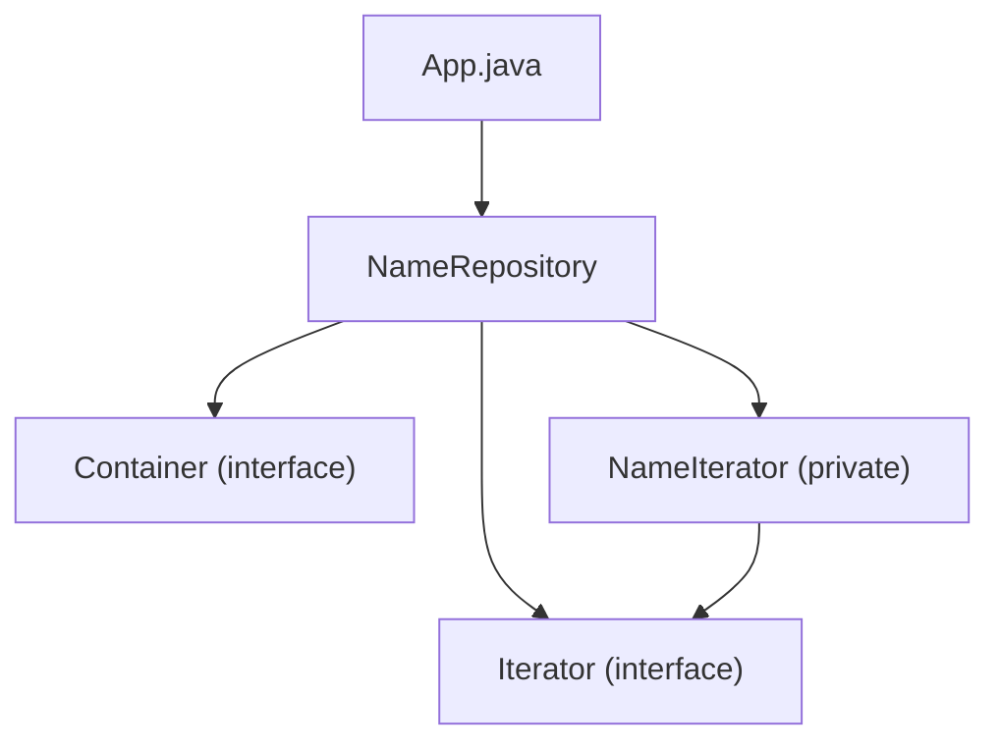

# Iterator Pattern

## What is the Iterator Pattern?
The Iterator Pattern is a behavioral design pattern that lets you access elements of a collection without exposing its underlying representation (list, stack, tree, etc.).

## Implementation in This Project
This example demonstrates the Iterator pattern by creating a name repository with an iterator:

- `Container`: Aggregate interface.
- `Iterator`: Iterator interface.
- `NameRepository`: Concrete aggregate with a private iterator implementation.

## Class Diagram


## Example Usage
```java
NameRepository namesRepository = new NameRepository();

for(Iterator iter = namesRepository.getIterator(); iter.hasNext();){
    String name = (String)iter.next();
    System.out.println("Name : " + name);
}
```

## When to Use
- When you want to access a collection's contents without exposing its internal structure.
- When you want to support multiple traversal methods for a collection. 