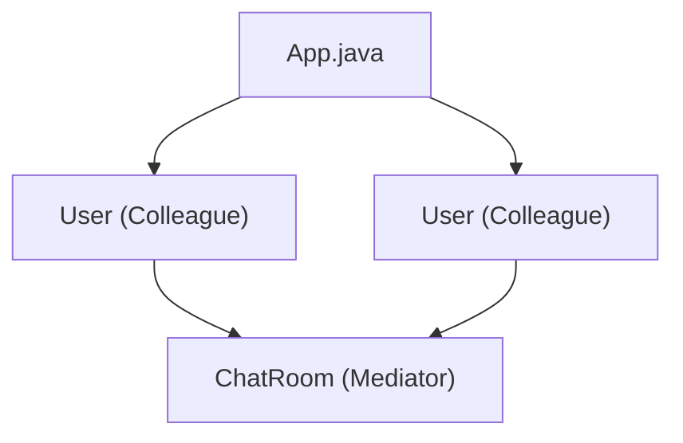

# Mediator Pattern

## What is the Mediator Pattern?
The Mediator Pattern is a behavioral design pattern that lets you reduce chaotic dependencies between objects. The pattern restricts direct communications between the objects and forces them to collaborate only via a mediator object.

## Implementation in This Project
This example demonstrates the Mediator pattern by using a chat room to mediate user communication:

- `ChatRoom`: Mediator that handles communication between users.
- `User`: Colleague that communicates through the mediator.

## Class Diagram


## Example Usage
```java
User robert = new User("Robert");
User john = new User("John");

robert.sendMessage("Hi! John!");
john.sendMessage("Hello! Robert!");
```

## When to Use
- When you want to reduce coupling between classes.
- When you want to centralize complex communications and control logic. 