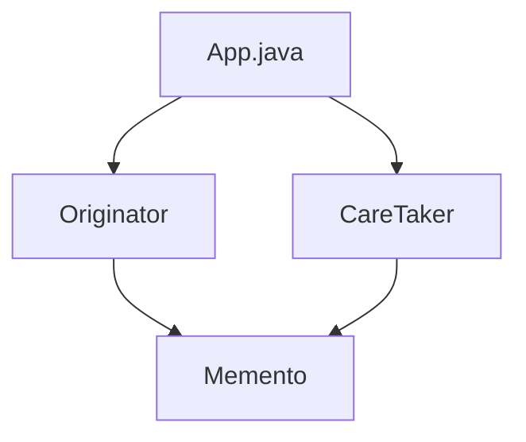

# Memento Pattern

## What is the Memento Pattern?
The Memento Pattern is a behavioral design pattern that lets you save and restore the previous state of an object without revealing the details of its implementation.

## Implementation in This Project
This example demonstrates the Memento pattern by saving and restoring object states:

- `Originator`: Creates and restores mementos.
- `Memento`: Stores the state of the originator.
- `CareTaker`: Manages the collection of mementos.

## Class Diagram


## Example Usage
```java
Originator originator = new Originator();
CareTaker careTaker = new CareTaker();

originator.setState("State #1");
originator.setState("State #2");
careTaker.add(originator.saveStateToMemento());
originator.setState("State #3");
careTaker.add(originator.saveStateToMemento());
originator.setState("State #4");

System.out.println("Current State: " + originator.getState());
originator.getStateFromMemento(careTaker.get(0));
System.out.println("First saved State: " + originator.getState());
```

## When to Use
- When you want to produce snapshots of the object's state.
- When you want to implement the undo functionality. 