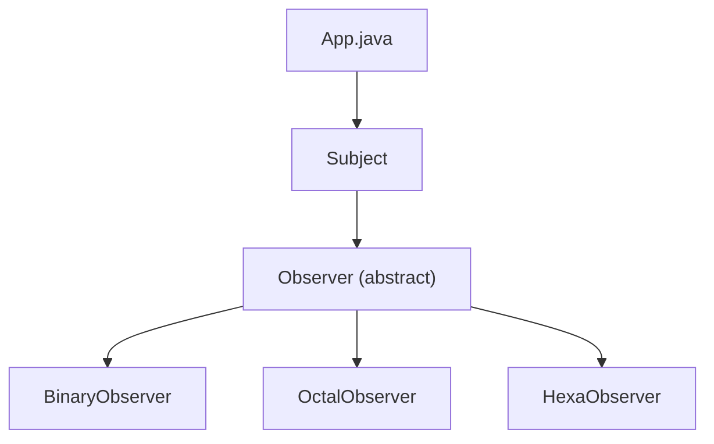

# Observer Pattern

## What is the Observer Pattern?
The Observer Pattern is a behavioral design pattern that lets you define a subscription mechanism to notify multiple objects about any events that happen to the object they're observing.

## Implementation in This Project
This example demonstrates the Observer pattern by using a subject with multiple observers:

- `Subject`: The object being observed.
- `Observer`: Abstract observer class.
- `BinaryObserver`, `OctalObserver`, `HexaObserver`: Concrete observers.

## Class Diagram


## Example Usage
```java
Subject subject = new Subject();

new HexaObserver(subject);
new OctalObserver(subject);
new BinaryObserver(subject);

System.out.println("First state change: 15");
subject.setState(15);
System.out.println("Second state change: 10");
subject.setState(10);
```

## When to Use
- When you want to notify multiple objects about changes in another object's state.
- When you want to implement a one-to-many dependency between objects. 