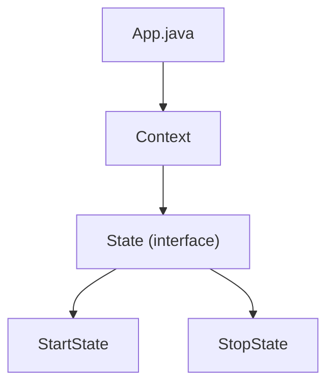

# State Pattern

## What is the State Pattern?
The State Pattern is a behavioral design pattern that lets an object alter its behavior when its internal state changes. The object will appear to change its class.

## Implementation in This Project
This example demonstrates the State pattern by using different states:

- `State`: State interface.
- `Context`: Context that maintains a reference to a state object.
- `StartState`, `StopState`: Concrete states.

## Class Diagram


## Example Usage
```java
Context context = new Context();

StartState startState = new StartState();
startState.doAction(context);

System.out.println(context.getState().toString());

StopState stopState = new StopState();
stopState.doAction(context);

System.out.println(context.getState().toString());
```

## When to Use
- When an object's behavior depends on its state.
- When you have a lot of conditional statements that depend on the object's state. 