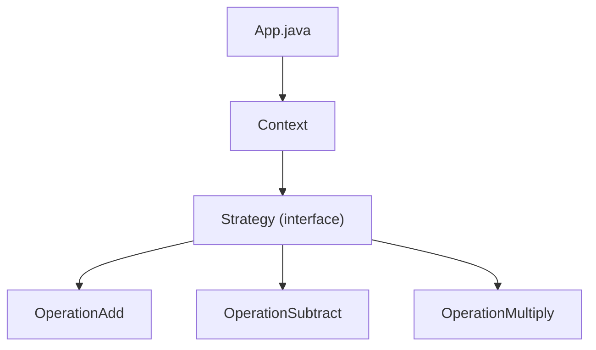

# Strategy Pattern

## What is the Strategy Pattern?
The Strategy Pattern is a behavioral design pattern that lets you define a family of algorithms, put each of them into a separate class, and make their objects interchangeable.

## Implementation in This Project
This example demonstrates the Strategy pattern by implementing different mathematical operations:

- `Strategy`: Strategy interface.
- `OperationAdd`, `OperationSubtract`, `OperationMultiply`: Concrete strategies.
- `Context`: Context that uses a strategy.

## Class Diagram


## Example Usage
```java
Context context = new Context(new OperationAdd());
System.out.println("10 + 5 = " + context.executeStrategy(10, 5));

context = new Context(new OperationSubtract());
System.out.println("10 - 5 = " + context.executeStrategy(10, 5));

context = new Context(new OperationMultiply());
System.out.println("10 * 5 = " + context.executeStrategy(10, 5));
```

## When to Use
- When you want to use different variants of an algorithm within an object.
- When you have a lot of similar classes that only differ in the way they execute some behavior. 