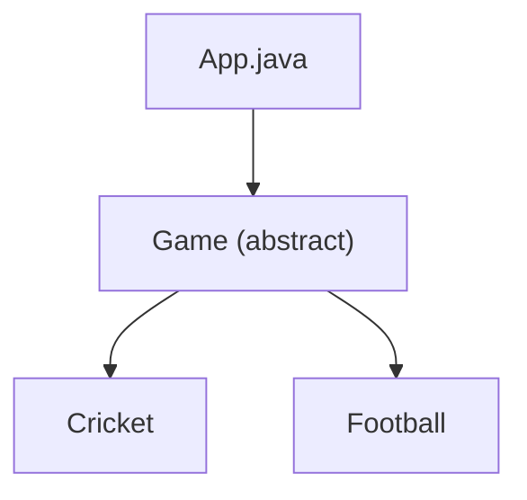

# Template Method Pattern

## What is the Template Method Pattern?
The Template Method Pattern is a behavioral design pattern that defines the skeleton of an algorithm in a method, deferring some steps to subclasses. Template Method lets subclasses redefine certain steps of an algorithm without changing the algorithm's structure.

## Implementation in This Project
This example demonstrates the Template Method pattern by implementing different games:

- `Game`: Abstract class with template method.
- `Cricket`, `Football`: Concrete games that implement specific steps.

## Class Diagram


## Example Usage
```java
Game game = new Cricket();
game.play();
System.out.println();
game = new Football();
game.play();
```

## When to Use
- When you want to let clients extend only particular steps of an algorithm.
- When you have several classes that contain almost identical algorithms with some minor differences. 