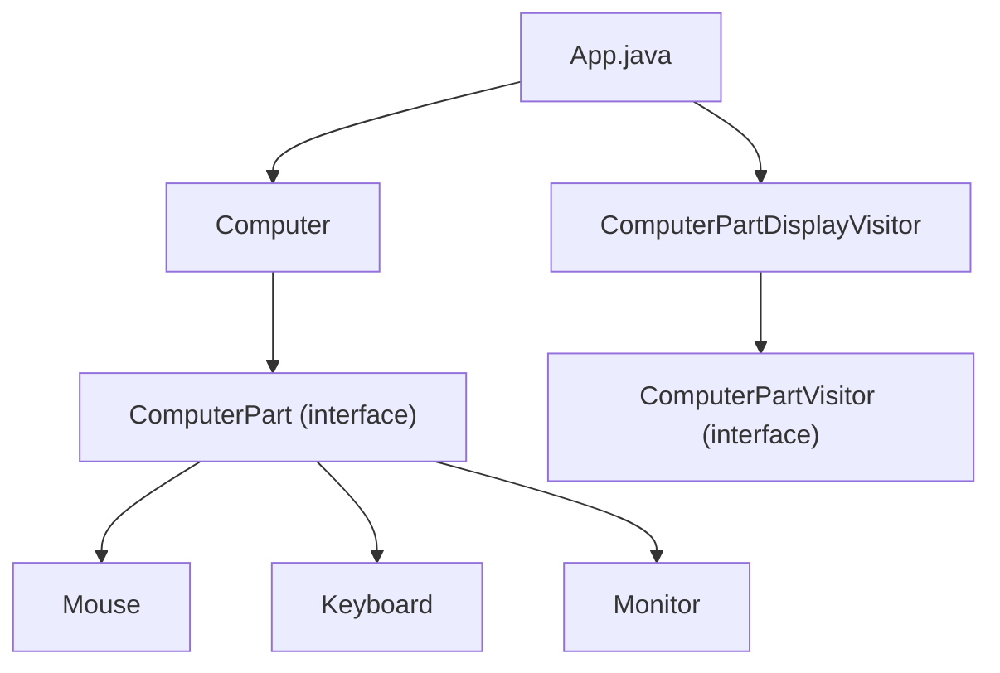

# Visitor Pattern

## What is the Visitor Pattern?
The Visitor Pattern is a behavioral design pattern that lets you separate algorithms from the objects on which they operate. It allows you to add new operations to existing object structures without modifying the structures themselves.

## Implementation in This Project
This example demonstrates the Visitor pattern by implementing computer parts with a visitor:

- `ComputerPart`: Element interface.
- `Computer`, `Mouse`, `Keyboard`, `Monitor`: Concrete elements.
- `ComputerPartVisitor`: Visitor interface.
- `ComputerPartDisplayVisitor`: Concrete visitor.

## Class Diagram


## Example Usage
```java
ComputerPart computer = new Computer();
computer.accept(new ComputerPartDisplayVisitor());
```

## When to Use
- When you want to perform operations on a set of objects with different classes.
- When you want to add new operations to existing classes without changing their structure. 