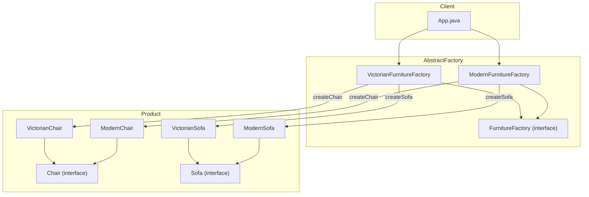

# Abstract Factory Pattern

## What is the Abstract Factory Pattern?
The Abstract Factory Pattern is a creational design pattern that provides an interface for creating families of related or dependent objects without specifying their concrete classes. It is useful when your code needs to work with various families of related products, but you don't want it to depend on the concrete classes of those products.

## Implementation in This Project
This example demonstrates the Abstract Factory pattern by allowing you to create Victorian or Modern furniture (Chair, Sofa) using the appropriate factory:

- `FurnitureFactory`: Abstract factory interface for creating products.
- `VictorianFurnitureFactory`, `ModernFurnitureFactory`: Concrete factories for Victorian and Modern furniture.
- `Chair`, `Sofa`: Product interfaces.
- `VictorianChair`, `ModernChair`, `VictorianSofa`, `ModernSofa`: Concrete products.

## Class Diagram


## Example Usage
```java
FurnitureFactory victorianFactory = new VictorianFurnitureFactory();
Chair victorianChair = victorianFactory.createChair();
Sofa victorianSofa = victorianFactory.createSofa();
System.out.println(victorianChair.getDescription());
System.out.println(victorianSofa.getDescription());

FurnitureFactory modernFactory = new ModernFurnitureFactory();
Chair modernChair = modernFactory.createChair();
Sofa modernSofa = modernFactory.createSofa();
System.out.println(modernChair.getDescription());
System.out.println(modernSofa.getDescription());
```

## When to Use
- When your code needs to work with various families of related products.
- When you want to enforce that products from one family are used together.