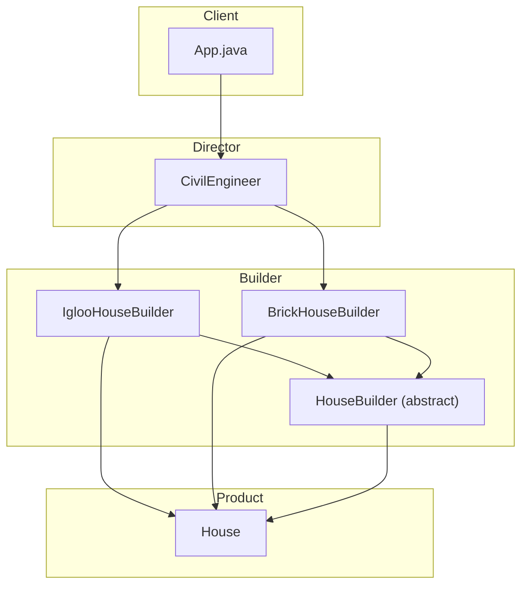

# Builder Pattern

## What is the Builder Pattern?
The Builder Pattern is a creational design pattern that lets you construct complex objects step by step. The pattern allows you to produce different types and representations of an object using the same construction code.

## Implementation in This Project
This example demonstrates the Builder pattern by constructing different types of houses (Igloo, Brick) using different builders:

- `HouseBuilder`: Abstract builder for constructing House objects.
- `IglooHouseBuilder`, `BrickHouseBuilder`: Concrete builders for specific house types.
- `CivilEngineer`: Director that constructs a House using a builder.
- `House`: The product being built.

## Class Diagram


## Example Usage
```java
// Build an Igloo house
HouseBuilder iglooBuilder = new IglooHouseBuilder();
CivilEngineer engineer1 = new CivilEngineer(iglooBuilder);
engineer1.constructHouse();
House igloo = engineer1.getHouse();
System.out.println(igloo);

// Build a Brick house
HouseBuilder brickBuilder = new BrickHouseBuilder();
CivilEngineer engineer2 = new CivilEngineer(brickBuilder);
engineer2.constructHouse();
House brickHouse = engineer2.getHouse();
System.out.println(brickHouse);
```

## When to Use
- When you need to construct complex objects step by step.
- When you want to create different representations of the same type of object.