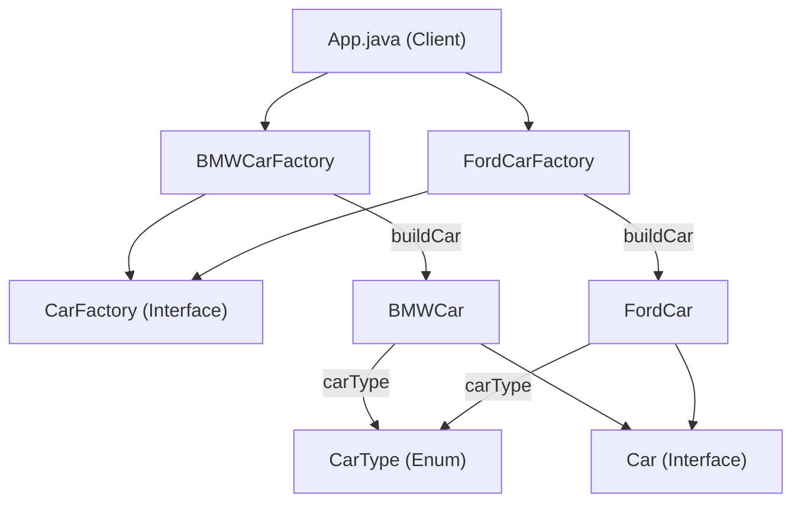

# Factory Method Pattern

## What is the Factory Method Pattern?
The Factory Method Pattern is a creational design pattern that provides an interface for creating objects in a superclass, but allows subclasses to alter the type of objects that will be created. It helps promote loose coupling by eliminating the need to bind application-specific classes into the code.

## Implementation in This Project
In this example, we use the Factory Method pattern to create different types of cars (BMW, Ford) without specifying the exact class of the object that will be created. The client code interacts with the `CarFactory` interface, and concrete factories (`BMWCarFactory`, `FordCarFactory`) implement the creation logic for specific car brands.

- `CarFactory`: Interface for car factories.
- `BMWCarFactory`, `FordCarFactory`: Concrete factories for BMW and Ford cars.
- `Car`: Interface for car products.
- `BMWCar`, `FordCar`: Concrete car products.
- `CarType`: Enum for car types (SUV, SEDAN, ELECTRIC).

## Class Diagram



## Example Usage
```java
CarFactory bmwFactory = new BMWCarFactory();
Car bmwSUV = bmwFactory.buildCar(CarType.SUV);
System.out.println(bmwSUV.getDescription());

CarFactory fordFactory = new FordCarFactory();
Car fordSedan = fordFactory.buildCar(CarType.SEDAN);
System.out.println(fordSedan.getDescription());
```

## When to Use
- When a class can't anticipate the class of objects it must create.
- When subclasses are expected to specify the objects to be created.
- To localize the knowledge of which helper subclass is the delegate.