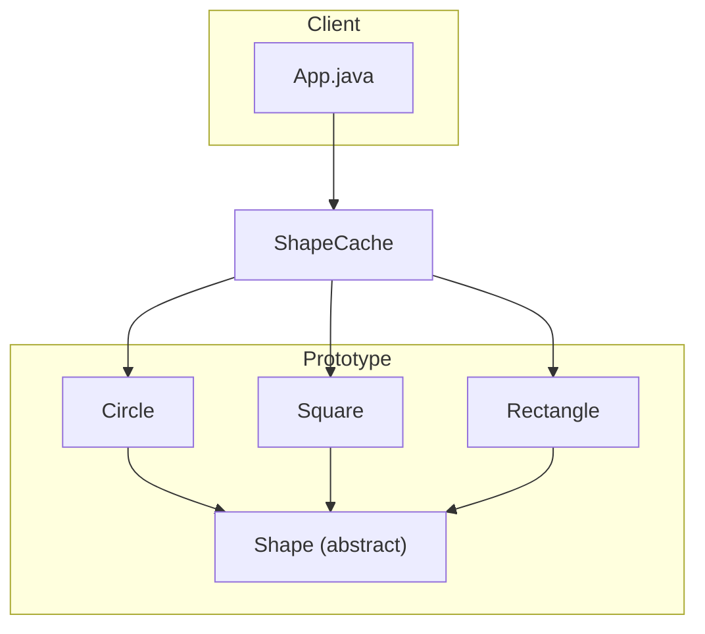

# Prototype Pattern

## What is the Prototype Pattern?
The Prototype Pattern is a creational design pattern that lets you copy existing objects without making your code dependent on their classes. It is useful when the cost of creating a new object is more expensive than copying an existing one.

## Implementation in This Project
This example demonstrates the Prototype pattern by cloning shape objects (Circle, Square, Rectangle) from a cache:

- `Shape`: Abstract prototype class implementing `Cloneable`.
- `Circle`, `Square`, `Rectangle`: Concrete prototypes.
- `ShapeCache`: Stores shape prototypes and allows cloning them.

## Class Diagram


## Example Usage
```java
ShapeCache.loadCache();

Shape clonedShape1 = ShapeCache.getShape("1");
System.out.println("Shape : " + clonedShape1.getType());
clonedShape1.draw();

Shape clonedShape2 = ShapeCache.getShape("2");
System.out.println("Shape : " + clonedShape2.getType());
clonedShape2.draw();

Shape clonedShape3 = ShapeCache.getShape("3");
System.out.println("Shape : " + clonedShape3.getType());
clonedShape3.draw();
```

## When to Use
- When the cost of creating a new object is more expensive than copying an existing one.
- When you want to avoid subclasses of an object creator in the client application.