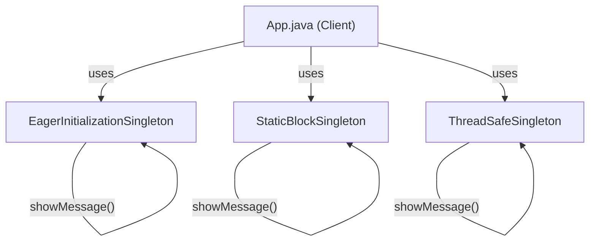

# Singleton Pattern

## What is the Singleton Pattern?
The Singleton Pattern is a creational design pattern that ensures a class has only one instance and provides a global point of access to it. This is useful when exactly one object is needed to coordinate actions across the system.

## Implementation in This Project
This example demonstrates several ways to implement the Singleton pattern in Java:

- **Eager Initialization:** The instance is created at class loading time.
- **Static Block Initialization:** The instance is created in a static block, allowing for exception handling.
- **Thread Safe Singleton:** The instance is created in a thread-safe manner, using either a synchronized method or double-checked locking.

## Class Diagram


## Example Usage
```java
// Eager Initialization Singleton
EagerInitializationSingleton.getINSTANCE().showMessage();

// Static Block Initialization Singleton
StaticBlockSingleton.getInstance().showMessage();

// Thread Safe Singleton
ThreadSafeSingleton.getThreadSafeSingletonInstance().showMessage();

// Thread Safe Singleton using double checking
ThreadSafeSingleton.getThreadSafeSingletonUsingDoubleCheckingInstance().showMessage();
```

## When to Use
- When exactly one instance of a class is needed.
- When a single object must coordinate actions across the system.