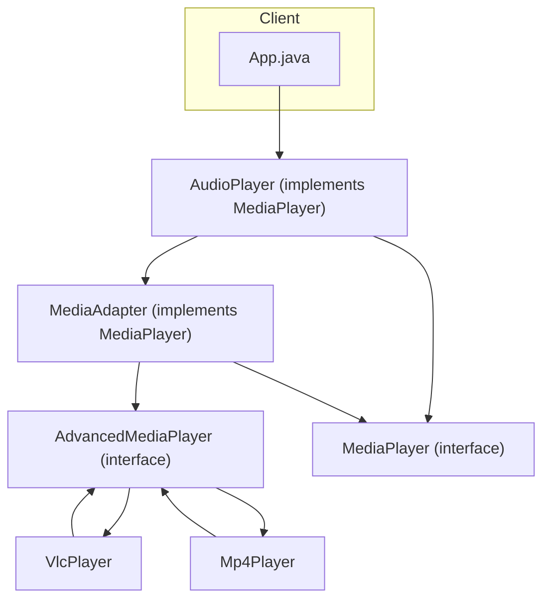

# Adapter Pattern

## What is the Adapter Pattern?
The Adapter Pattern is a structural design pattern that allows objects with incompatible interfaces to work together. The adapter acts as a bridge between the two incompatible interfaces.

## Implementation in This Project
This example demonstrates the Adapter pattern by allowing an `AudioPlayer` to play different audio formats (mp3, mp4, vlc) using adapters:

- `MediaPlayer`: Target interface expected by the client.
- `AdvancedMediaPlayer`: Adaptee interface for advanced players.
- `VlcPlayer`, `Mp4Player`: Concrete adaptees.
- `MediaAdapter`: Adapter that adapts `AdvancedMediaPlayer` to `MediaPlayer`.
- `AudioPlayer`: Client that uses the adapter.

## Class Diagram


## Example Usage
```java
AudioPlayer audioPlayer = new AudioPlayer();
audioPlayer.play("mp3", "beyond_the_horizon.mp3");
audioPlayer.play("mp4", "alone.mp4");
audioPlayer.play("vlc", "far_far_away.vlc");
audioPlayer.play("avi", "mind_me.avi");
```

## When to Use
- When you want to use an existing class, but its interface does not match the one you need.
- When you want to create a reusable class that cooperates with unrelated or unforeseen classes.