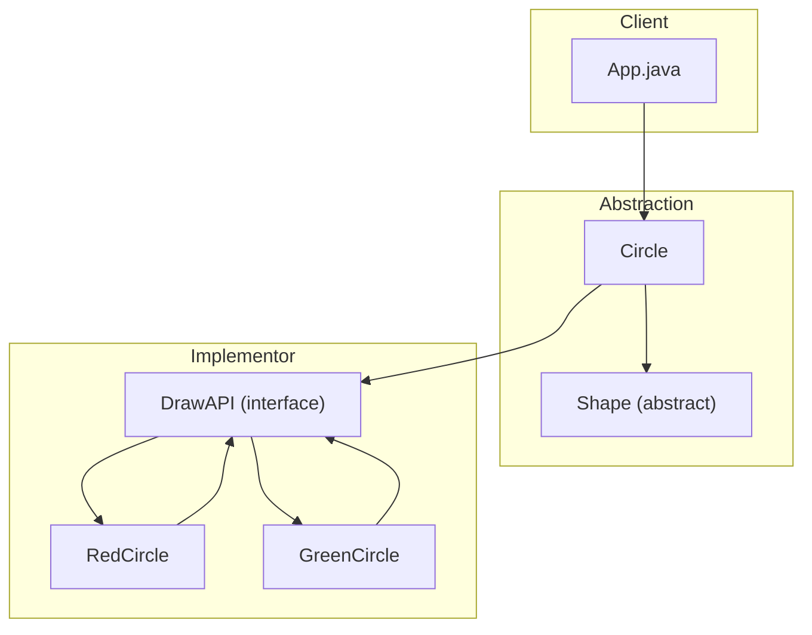

# Bridge Pattern

## What is the Bridge Pattern?
The Bridge Pattern is a structural design pattern that lets you split a large class or a set of closely related classes into two separate hierarchies—abstraction and implementation—which can be developed independently of each other.

## Implementation in This Project
This example demonstrates the Bridge pattern by drawing circles with different colors using different implementations:

- `Shape`: Abstraction class.
- `Circle`: Refined abstraction.
- `DrawAPI`: Implementor interface.
- `RedCircle`, `GreenCircle`: Concrete implementors.

## Class Diagram


## Example Usage
```java
Circle redCircle = new Circle(100, 100, 10, new RedCircle());
Circle greenCircle = new Circle(100, 100, 10, new GreenCircle());

redCircle.draw();
greenCircle.draw();
```

## When to Use
- When you want to avoid a permanent binding between an abstraction and its implementation.
- When both the abstractions and their implementations should be extensible by subclassing independently.