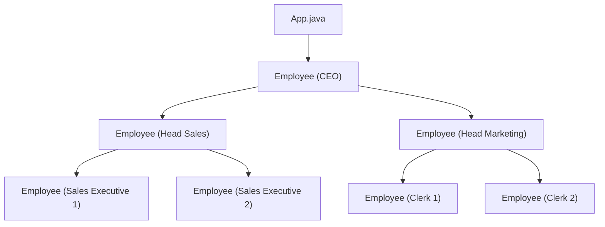

# Composite Pattern

## What is the Composite Pattern?
The Composite Pattern is a structural design pattern that lets you compose objects into tree structures to represent part-whole hierarchies. Composite lets clients treat individual objects and compositions of objects uniformly.

## Implementation in This Project
This example demonstrates the Composite pattern by building an employee hierarchy:

- `Employee`: Component class that can act as both a leaf and a composite.
- The organization is built as a tree of employees, where each employee can have subordinates.

## Class Diagram


## Example Usage
```java
Employee CEO = new Employee("John", "CEO", 30000);
Employee headSales = new Employee("Robert", "Head Sales", 20000);
Employee headMarketing = new Employee("Michel", "Head Marketing", 20000);
Employee clerk1 = new Employee("Laura", "Marketing", 10000);
Employee clerk2 = new Employee("Bob", "Marketing", 10000);
Employee salesExecutive1 = new Employee("Richard", "Sales", 10000);
Employee salesExecutive2 = new Employee("Rob", "Sales", 10000);

CEO.add(headSales);
CEO.add(headMarketing);
headSales.add(salesExecutive1);
headSales.add(salesExecutive2);
headMarketing.add(clerk1);
headMarketing.add(clerk2);

System.out.println(CEO);
for (Employee headEmployee : CEO.getSubordinates()) {
    System.out.println("  " + headEmployee);
    for (Employee employee : headEmployee.getSubordinates()) {
        System.out.println("    " + employee);
    }
}
```

## When to Use
- When you want to represent part-whole hierarchies of objects.
- When you want clients to be able to ignore the difference between compositions of objects and individual objects.