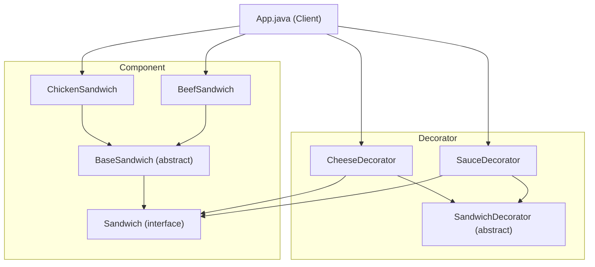

# Decorator Pattern

## What is the Decorator Pattern?
The Decorator Pattern is a structural design pattern that allows behavior to be added to individual objects, dynamically, without affecting the behavior of other objects from the same class. It is typically used to extend the functionalities of classes in a flexible and reusable way.

## Implementation in This Project
This example demonstrates the Decorator pattern by allowing you to add cheese and sauce to sandwiches at runtime:

- `Sandwich`: The component interface for all sandwiches.
- `BaseSandwich`: Abstract class providing a base price for sandwiches.
- `ChickenSandwich`, `BeefSandwich`: Concrete components representing specific sandwiches.
- `SandwichDecorator`: Abstract decorator class for sandwiches.
- `CheeseDecorator`, `SauceDecorator`: Concrete decorators that add cheese or sauce to a sandwich.

## Class Diagram


## Example Usage
```java
Sandwich myChickenSandwich = new ChickenSandwich();
myChickenSandwich = new CheeseDecorator(myChickenSandwich, 5);
myChickenSandwich = new SauceDecorator(myChickenSandwich);
System.out.println(myChickenSandwich.getDescription() + ": " + myChickenSandwich.price());

Sandwich myBeefSandwich = new SauceDecorator(new CheeseDecorator(new BeefSandwich(), 3));
System.out.println(myBeefSandwich.getDescription() + ": " + myBeefSandwich.price());
```

## When to Use
- When you want to add responsibilities to individual objects dynamically and transparently.
- When extension by subclassing is impractical or impossible.