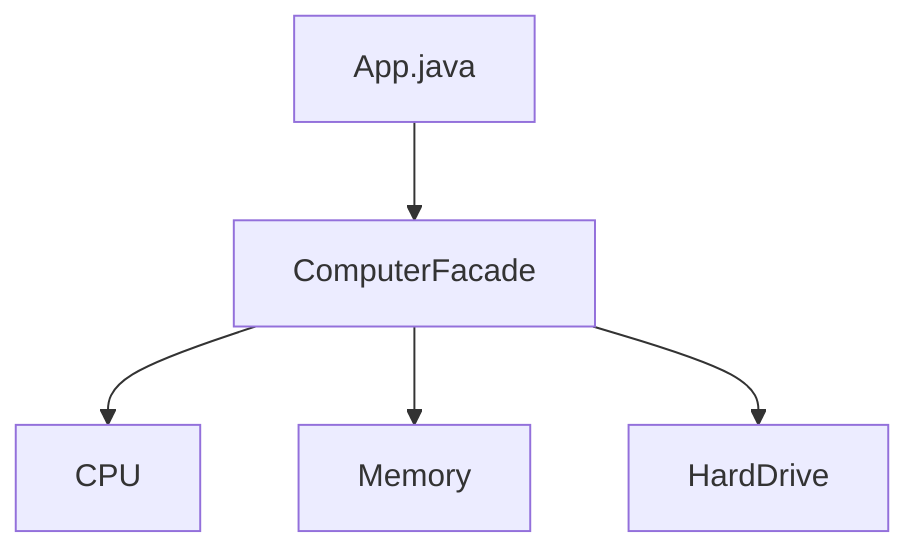

# Facade Pattern

## What is the Facade Pattern?
The Facade Pattern is a structural design pattern that provides a simplified interface to a complex subsystem. It defines a higher-level interface that makes the subsystem easier to use.

## Implementation in This Project
This example demonstrates the Facade pattern by providing a `ComputerFacade` to start a computer, hiding the complexity of the underlying subsystems:

- `ComputerFacade`: Facade class that provides a simple interface.
- `CPU`, `Memory`, `HardDrive`: Subsystem classes.

## Class Diagram


## Example Usage
```java
ComputerFacade computer = new ComputerFacade();
computer.start();
```

## When to Use
- When you want to provide a simple interface to a complex subsystem.
- When there are many dependencies between clients and the implementation classes of an abstraction.