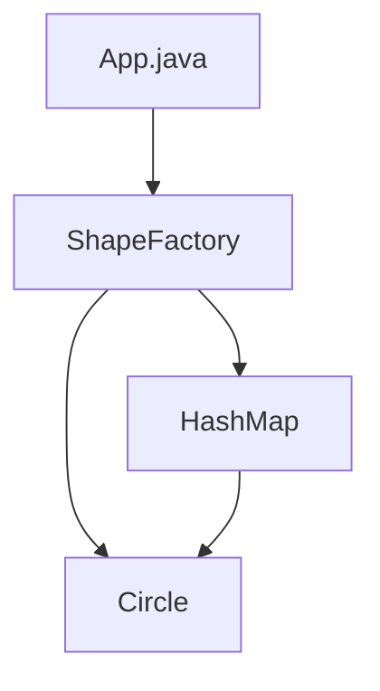

# Flyweight Pattern

## What is the Flyweight Pattern?
The Flyweight Pattern is a structural design pattern that lets you fit more objects into the available amount of RAM by sharing common parts of state between multiple objects instead of keeping all of the data in each object.

## Implementation in This Project
This example demonstrates the Flyweight pattern by creating circles with different colors, where circles of the same color are shared:

- `Circle`: Flyweight class that stores intrinsic state (color) and extrinsic state (x, y, radius).
- `ShapeFactory`: Flyweight factory that manages and reuses Circle objects based on color.

## Class Diagram


## Example Usage
```java
for(int i=0; i < 20; ++i) {
    Circle circle = ShapeFactory.getCircle(getRandomColor());
    circle.setX(getRandomX());
    circle.setY(getRandomY());
    circle.setRadius(100);
    circle.draw();
}
```

## When to Use
- When you need to reduce the number of objects created.
- When you have a large number of similar objects that consume a lot of memory. 