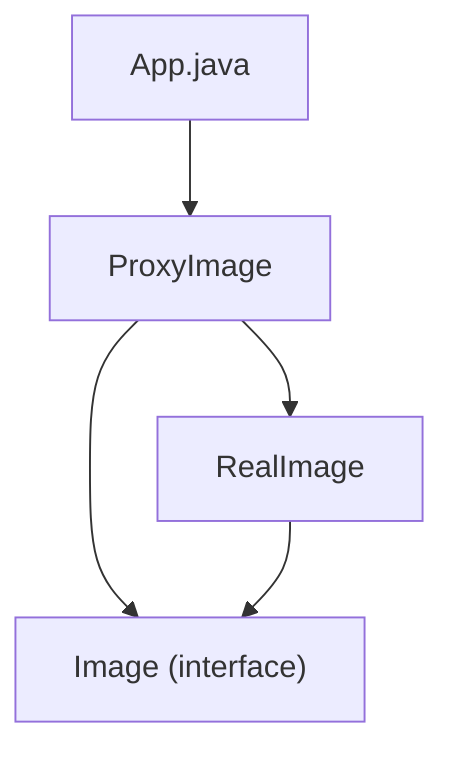

# Proxy Pattern

## What is the Proxy Pattern?
The Proxy Pattern is a structural design pattern that lets you provide a substitute or placeholder for another object. A proxy controls access to the original object, allowing you to perform something either before or after the request gets through to the original object.

## Implementation in This Project
This example demonstrates the Proxy pattern by using a `ProxyImage` to control access to a `RealImage`:

- `Image`: Subject interface.
- `RealImage`: Real subject that loads and displays images.
- `ProxyImage`: Proxy that controls access to the real image.

## Class Diagram


## Example Usage
```java
Image image = new ProxyImage("test_10mb.jpg");

// Image will be loaded from disk
image.display();
System.out.println("");

// Image will not be loaded from disk
image.display();
```

## When to Use
- When you want to control access to an object.
- When you want to add a wrapper and delegation to protect the real component from undue complexity. 